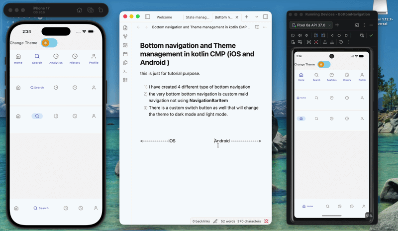

# Compose Multiplatform Bottom Navigation Styles 🎨

This project is a Compose Multiplatform (KMP) playground designed to showcase various implementations of Bottom Navigation bars. It ranges from standard Material 3 components to highly customized, animated navigation patterns.

## 🚀 Features

- **4 Unique Navigation Styles**: 
    - **Style 1**: Clean, standard Material 3 `NavigationBar` implementation.
    - **Style 2**: Modern layout where text labels reveal themselves only on selection.
    - **Style 3**: Custom themed Material 3 bar with specific indicator and icon color tokens.
    - **Style 4**: Fully custom, animated "Pill" navigation featuring dynamic weights and smooth transitions.
- **Dark/Light Mode Support**: Includes a custom theme engine and a "Cute Toggle" to switch between themes on the fly.
- **Shared Codebase**: 100% of the UI and navigation logic is shared across platforms using Compose Multiplatform.
- **Modern Navigation**: Uses `navigation-compose` for handling backstack and state restoration.

## 🎥 Demo

Check out the app in action:

*(Note: If the GIF doesn't load in your preview, you can find it manually at `assets/recording.gif`)*

## 🛠 Tech Stack

- **Framework**: [Compose Multiplatform](https://www.jetbrains.com/lp/compose-multiplatform/)
- **Language**: [Kotlin](https://kotlinlang.org/)
- **UI Components**: Material 3
- **Navigation**: Navigation Compose (Jetpack & Multiplatform)
- **Resources**: JetBrains Compose Resources (for shared drawables and strings)

## 📁 Project Structure

- `shared/src/commonMain/kotlin/com/example/bottomnavigation/component/`: Contains all the navigation style implementations.
- `shared/src/commonMain/kotlin/com/example/bottomnavigation/ui/theme/`: Custom theme definitions and screen configurations.
- `shared/src/commonMain/composeResources/`: Shared icons and assets.

## ⚙️ How to Run

1. Clone the repository.
2. Open the project in **Android Studio** or **IntelliJ IDEA**.
3. To run on Android: Select the `androidApp` configuration and click Run.
4. To run on Desktop/iOS: Ensure you have the necessary environment setup and run the respective tasks.

## 💡 Learning Purpose

This project was built to explore:
- Advanced animations in Jetpack Compose.
- Customizing Material 3 components beyond the defaults.
- Handling complex UI state in a multiplatform environment.
- Implementation of dynamic layouts using Compose `Modifier.weight`.

---
Made with ❤️ by [Shashank]
